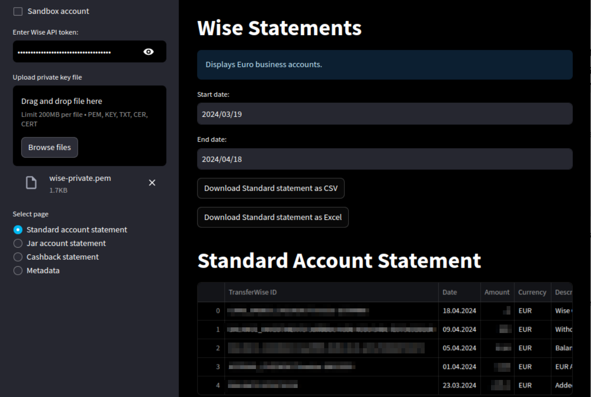
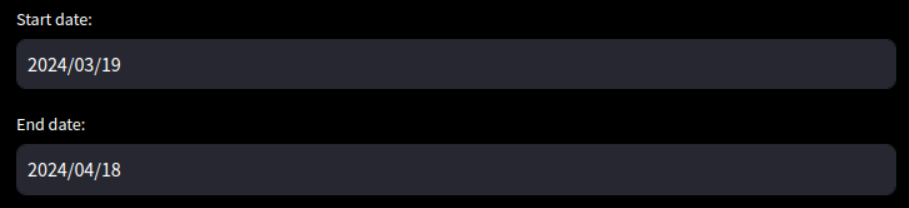

# Wise Statements Viewer

The Wise statements viewer is a streamlit app, which displays [Wise](https://wise.com/) account statements.  The app is built using Wise's [API](https://docs.wise.com/api-docs/api-reference). Its functionality is designed for a specific use case:

- Business accounts only.
- Both standard accounts and [Jar accounts](https://wise.com/help/articles/2978074/what-are-jars-and-how-do-i-use-them) (if they exist).
- EUR currency only.
- The date output is formatted in the European standard: dd.mm.yyyy.

However, the code can easily be modified.

# App Description



## Authentication

In order to link the app with Wise, you must first create an API token with your account.  Then you must create public and private keys and register them with your Wise account. Refer to the authentication instructions below if you are not familiar with this process.

## Using the app

Once the app is running in your browser, you must link it to your account:

1. On the left sidebar, enter your API token.
2. Under "Upload private key file," click the "Browse files" button, and select your private key file.


- Note: if you set `WISE_API_TOKEN` as an environment variable, the app will automatically use this token. Only the 'Upload private key file' field will be displayed.

And that's it! Once you are linked to your account, the side panel will show four pages:


## Statement Pages:

If one of the "statement" pages is selected, the main field will display a choice of start and end date (yyyy/mm/dd) for the statement you would like to view:



The default start and end dates are 30 days prior and the current date, respectively. While navigating the statement pages, your choice of date range will be preserved. If you navigate to the metadata page, the date range will reset. 

For each statement page, a dataframe will be displayed for the selected date range, and two buttons are displayed to download the dataframe as either a CSV or an Excel file:


Some dataframe comments:

- For the standard and for the jar accounts, the page displays a full statement dataframe.
- For the cashback payment, a dataframe is displayed for all Wise cashback payments with jar and standard account transactions both included.  Wise's cashback transactions are subject to a tax withholding, with a rate of 30% at the time of this writing. The full tax withheld amount for each transaction is displayed in the dataframe, along with a total tally in the last row.

## Metadata Page

The fourth page displays the JSON-formatted metadata for the account: 

- Profile metadata: account type, address, creation date, etc.
- Standard account balance metadata: currency, account number, balance, etc.
- Jar account balance metadata (same)
    - If a jar account does not exist, an empty {} will be displayed. 

## Comments:

- If you would like to test the app using a [sandbox account](https://docs.wise.com/api-docs/features/authentication-access/environments), you must enable the sandbox API endpoints by clicking the "sandbox account" checkbox in the top left corner:


- If you have multiple business accounts with the EUR currency, only the first one listed in the metadata will be displayed.
- The API endpoints for the cashback information and the account metadata do not require Strong Customer Authentication (SCA).  As a result, if you enter your account's API token, but an incorrect private key file, the `get` command running in the app will not throw an error.  Hence the last two pages will be generated successfully.
- If you have a `WISE_API_TOKEN` set as an environment variable, you can run the app without entering the token each time.

## Developer Note

For any developers who would like to make edits, note that all generations of the application's interface and main functionality are centralized within the `app.py` file. All interactions with the Wise API, including data retrieval and processing, are managed in the `wise.py` file. Developers interested in understanding or contributing to the application's core functionality or its API integration are encouraged to review these specific files for detailed insights into the implementation.

## Authentication Instructions

The following are instructions you can follow for creating an API token and public/private keys for Wise.

1. Create an API token and register it with Wise:
    - Go to [Wise](https://wise.com) and log in to your account.
    - Go to Settings > API tokens > Create a token.
    - Store the token in a secure location on your computer. Consider using a password manager or encrypted storage.
2. Create a public and private key.  In a terminal (Linux/macOS) or Command Prompt/PowerShell (Windows), do the following:
    - All users: create the directory in a secure location on your computer:
        - `mkdir YOUR_DIRECTORY`
    - Linux/macOS:
        - `openssl genrsa -out YOUR_DIRECTORY/YOUR_FILENAME-private.pem 2048`
        - `openssl rsa -pubout -in YOUR_DIRECTORY/YOUR_FILENAME-private.pem -out YOUR_DIRECTORY/YOUR_FILENAME-public.pem`
    - Windows:
        - Ensure OpenSSL is installed on your computer.  If not, you can download it from [here](https://slproweb.com/products/Win32OpenSSL.html), or a package manager.
        - Use the same commands as above in your PowerShell or Command Prompt. You might need to specify the full path to the OpenSSL executable if it's not added to your `PATH` environment variable.

3. Register public key with Wise
    - Log in to your Wise account, then navigate to Settings > API tokens > Manage public keys. Add the file `YOUR_FILENAME-public.pem`.
    - Follow any on-screen instructions to complete the registration.

# Installation

## Local Installation (TL;DR version)

1. Clone the repo: 

```
git clone https://github.com/lolml-gmbh/wise-statements.git
```

### Environment setup for Anaconda

While in the repository directory, run the following command in a terminal:

```
conda create -n wise_env python=3.11.5 --yes
conda activate wise_env
conda install --file requirements.txt -c conda-forge
```

### Run the app:

- Navigate to the repository directory in your terminal.
- Activate the `wise_env` environment (`conda activate wise_env`).
- Run the app with streamlit: `streamlit run app.py`.
- Access app in your browser at `http://localhost:8501`.

## Local Installation (detailed version)

This repository is hosted by GitHub and can be accessed at the URL:

```
https://github.com/lolml-gmbh/wise-statements.git
```  

Clone the repository to your local machine by running the following command in your terminal:

```
git clone https://github.com/lolml-gmbh/wise-statements.git 
```

The app can be updated by using the `git pull` or `git fetch` commands while in the repo directory on your terminal:

```
git pull
```

### Install the dependencies

This app uses a Python distribution called Anaconda.  To install Anaconda, you can follow the instructions at (https://docs.anaconda.com/free/anaconda/install/).

### Create and activate the `wise_env` environment

Open a terminal and navigate to the directory where you cloned the repository.  Run the following command to create the `wise_env` environment:

```
conda create -n wise_env python=3.11.5 --yes
conda activate wise_env
conda install --file requirements.txt -c conda-forge
```
At any time, activate the `wise_env` environment by running the following command:

```
conda activate wise_env
```

### Update the `wise_env` environment

To update the `wise_env` environment, delete the existing environment and create it again:

```
conda env remove -n wise_env
```
### Run the app

To run the app, navigate to the repository directory in your terminal and activate the `wise_env` environment:

```
conda activate wise_env
```

Run the app with streamlit:

```
streamlit run app.py
```

The app should now be running at `http://localhost:8501` in your browser.

# Copyright and License

Copyright (c) 2024 [LOLML GmbH](https://lolml.com/), George Whelan

MIT License: see LICENSE file for details.

# Legal Notice

THE SOFTWARE IS PROVIDED "AS IS", WITHOUT WARRANTY OF ANY KIND, EXPRESS OR
IMPLIED, INCLUDING BUT NOT LIMITED TO THE WARRANTIES OF MERCHANTABILITY,
FITNESS FOR A PARTICULAR PURPOSE AND NONINFRINGEMENT. IN NO EVENT SHALL THE
AUTHORS OR COPYRIGHT HOLDERS BE LIABLE FOR ANY CLAIM, DAMAGES OR OTHER
LIABILITY, WHETHER IN AN ACTION OF CONTRACT, TORT OR OTHERWISE, ARISING FROM,
OUT OF OR IN CONNECTION WITH THE SOFTWARE OR THE USE OR OTHER DEALINGS IN THE
SOFTWARE.
